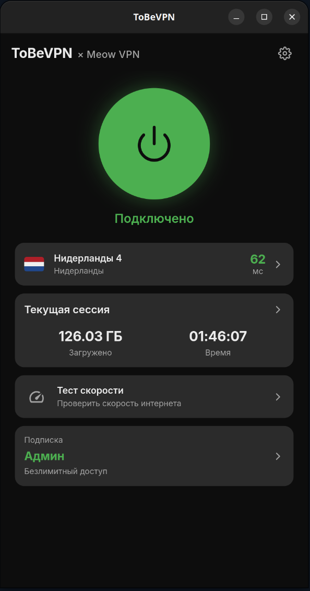
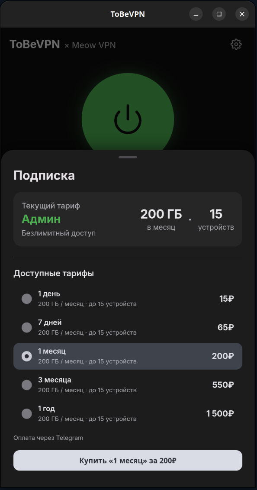
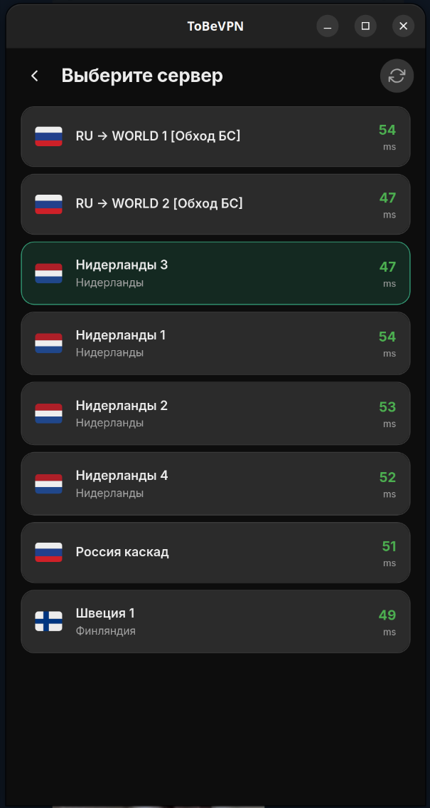
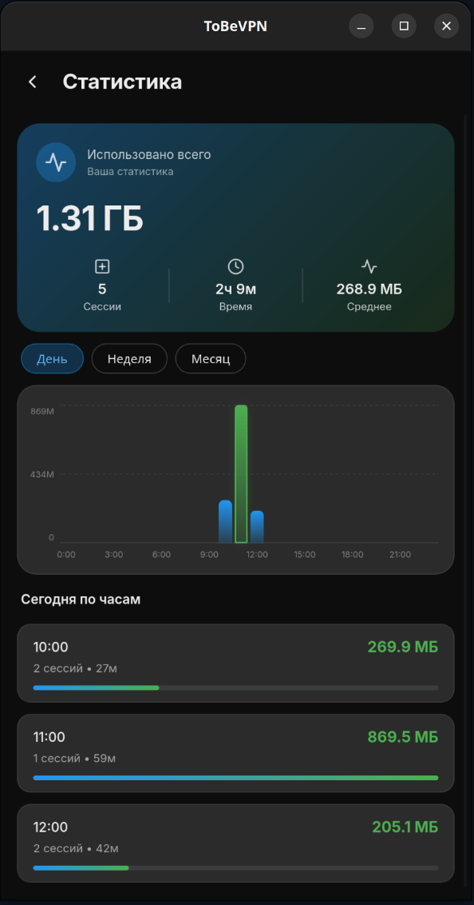
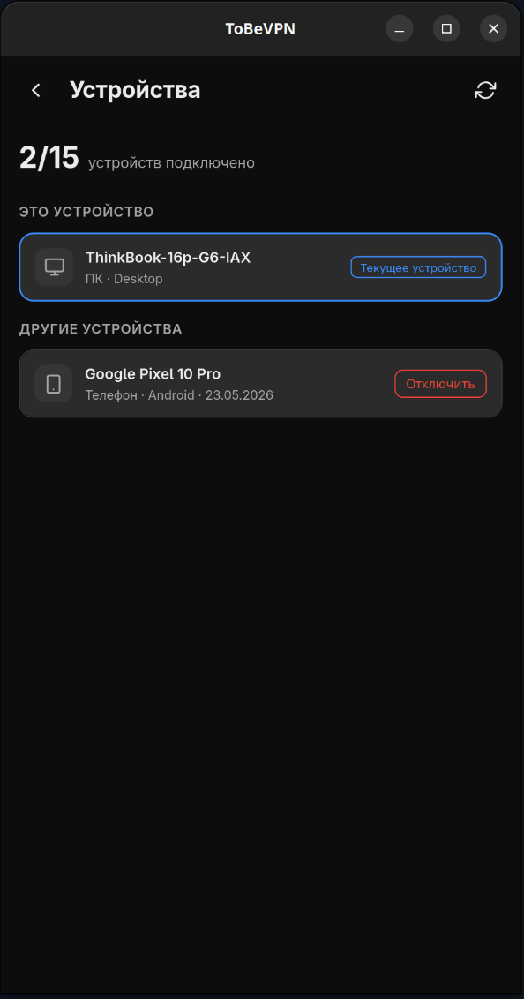
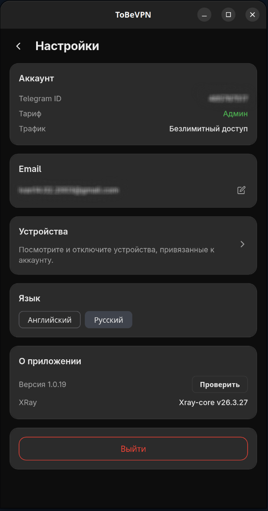

# ToBeVPN

**Современный VPN-клиент для Linux и Windows с подпиской, выбором серверов и встроенными обновлениями.**

---

## Что это

ToBeVPN — нативный desktop-клиент к VPN-сети с защищённым подключением, управлением подпиской и привязкой устройств. Авторизация через Telegram, список серверов с пингом, статистика трафика, speed test, встроенный обновлятор, безопасное локальное хранение device-session токенов — всё это.

## Главное

| | |
|--|--|
| 🛡️ **Защищённое подключение** | Современный протокол с маскировкой трафика, системный VPN через TUN |
| 🖥️ **Linux / Windows** | `.deb` для Linux и installer для Windows |
| 🔐 **Авторизация** | Без логина/пароля, Telegram flow, привязка устройства |
| 💳 **Подписка** | Текущий тариф, лимиты, устройства, пробный доступ и сценарии оплаты через backend flow |
| 🌍 **Выбор сервера** | Список нод с пингом, статусом доступности и сохранением последнего выбора |
| 📈 **Статистика** | Локальные сессии, длительность подключения и трафик |
| 🚦 **Speed test** | Замер скорости подключения из приложения |
| 💻 **Устройства** | Просмотр связанных устройств и отвязка текущего desktop-клиента |
| 🔄 **In-app updater** | Проверка и установка обновлений с проверкой подписи |
| 🔑 **Linux privileges** | После установки `.deb` VPN и обновления работают без повторных запросов пароля |
| 🌗 **Light / Dark / RU / EN** | Ручное переключение темы и языка |
| 🛟 **Fallback proxy** | При недоступности основного бэкенда — автоматический повтор через резервный proxy-маршрут |

## Скриншоты

  <table>
    <tr>
      <td align="center"><b>Главный экран</b></td>
      <td align="center"><b>Подписка</b></td>
      <td align="center"><b>Серверы</b></td>
    </tr>
    <tr>
      <td></td>
      <td></td>
      <td></td>
    </tr>
    <tr>
      <td align="center"><b>Статистика</b></td>
      <td align="center"><b>Устройства</b></td>
      <td align="center"><b>Настройки</b></td>
    </tr>
    <tr>
      <td></td>
      <td></td>
      <td></td>
    </tr>
  </table>

## Безопасность

- Backend-хосты не хранятся в исходниках — подставляются при сборке.
- Сетевые запросы ограничены конкретным списком разрешённых хостов.
- Auth/session токены хранятся в системном keyring.
- Обновления проверяются по цифровой подписи.
- Системный VPN на Linux работает через ограниченные polkit-helpers без постоянных запросов пароля.

## Связанные репозитории

- **Android-клиент:** [ToBeVPN-Android](https://github.com/Shoolife/ToBeVPN-Android) — нативный Android-клиент
- **Android TV-клиент:** [ToBeVPN-Android-TV](https://github.com/Shoolife/ToBeVPN-Android-TV) — Android TV / приставки

## Roadmap

- [ ] macOS release target
- [ ] Auto-server selection по latency
- [ ] Расширенная статистика по периодам
- [ ] Более подробные release notes

## Contributing

Issue welcome. PR — лучше предварительно обсудить через issue. Коммиты — present tense, conventional commits не обязательны но приветствуются.

## Лицензия

Проприетарное приложение. Исходный код предоставляется для прозрачности и self-host'инга — коммерческое использование/перепродажа запрещены.

---

  Сделано с ❤️ командой <b>ToBeVPN × Meow VPN</b>

